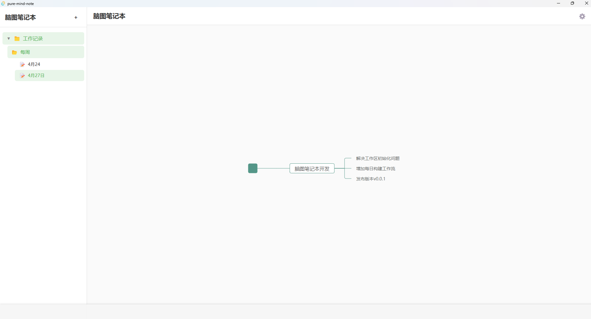
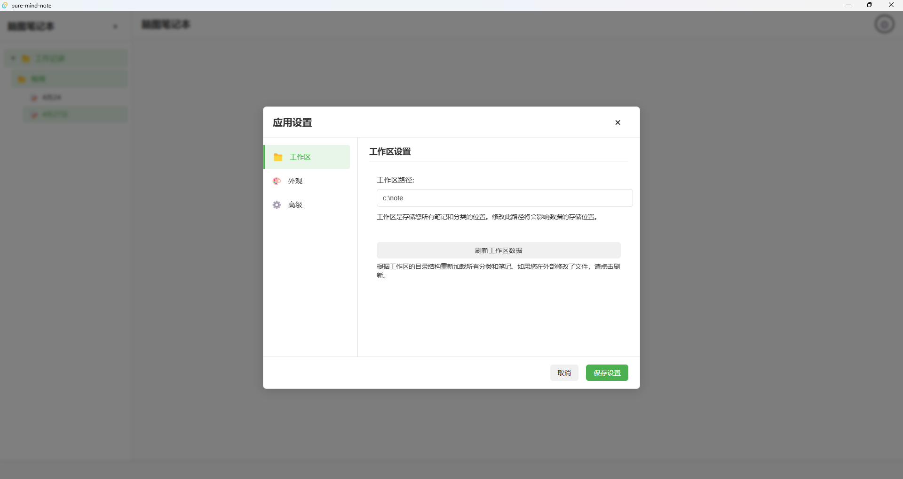

# 脑图笔记本 (Pure Mind Note)

<div align="center">
  
  
  <h3>简单、高效的思维导图笔记软件</h3>

</div>

## 📝 项目介绍

脑图笔记本是一款基于思维导图的笔记软件，旨在帮助用户以结构化的方式组织和管理想法。通过直观的思维导图界面，用户可以创建、编辑和管理笔记，提高工作效率和创造力。

### ✨ 主要特性

- 📋 支持创建和编辑思维导图笔记
- 🗂️ 笔记支持二级分类管理
- 💾 笔记以JSON格式保存在本地工作区
- 🖥️ 跨平台支持 (Windows, macOS, Linux)
- 🚀 高性能的本地应用体验

## 🖼️ 应用截图

<div align="center">
  
  
</div>

## 🚀 版本功能

### v0.0.1 (当前版本)

- ✅ 基础思维导图编辑功能
- ✅ 本地工作区设置
- ✅ 笔记二级分类管理
- ✅ JSON格式保存笔记
- ✅ 跨平台支持 (Windows/macOS/)

## 🛠️ 技术栈

- **前端框架**: React
- **构建工具**: Vite
- **桌面应用**: Tauri (Rust)
- **思维导图**: simple-mind-map

## 🚀 安装与使用

### 下载安装包

请访问 [Releases](https://github.com/yourusername/pure-mind-note/releases) 页面下载最新版本的安装包。

### 支持的平台

- Windows (.msi, .exe)
- macOS (.dmg)
- Linux (.deb, .AppImage)

### 从源码构建

如果您想从源码构建应用，请按照以下步骤操作：

1. 克隆仓库
```bash
git clone https://github.com/yourusername/pure-mind-note.git
cd pure-mind-note
```

2. 安装依赖
```bash
npm install
```

3. 开发模式运行
```bash
npm run tauri:dev
```

4. 构建应用
```bash
npm run tauri:build
```

## 📝 使用说明

### 工作区设置

首次启动应用时，需要设置工作区路径。工作区是存储所有笔记文件的目录。您可以在应用设置中更改工作区路径。

### 创建笔记

1. 点击左侧"+"按钮创建新笔记
2. 选择要创建笔记的分类或创建新分类
3. 使用思维导图编辑器编辑您的笔记内容

### 分类管理

- 支持二级分类结构（如工作记录/每周）
- 分类在工作区内以目录形式存储

## 🗺️ 路线图

### 未来规划

- [ ] 主题美化
- [ ] TODO标签功能
- [ ] 内容搜索功能
- [ ] 标签管理
- [ ] 节点详情编辑功能

## 📄 许可证

[MIT License](LICENSE)

## 🙏 鸣谢

- [simple-mind-map](https://github.com/wanglin2/mind-map) - 提供强大的思维导图功能
- [Tauri](https://tauri.app/) - 提供高性能的跨平台桌面应用框架
- [React](https://reactjs.org/) - 用户界面库
- [Vite](https://vitejs.dev/) - 前端构建工具 Linux